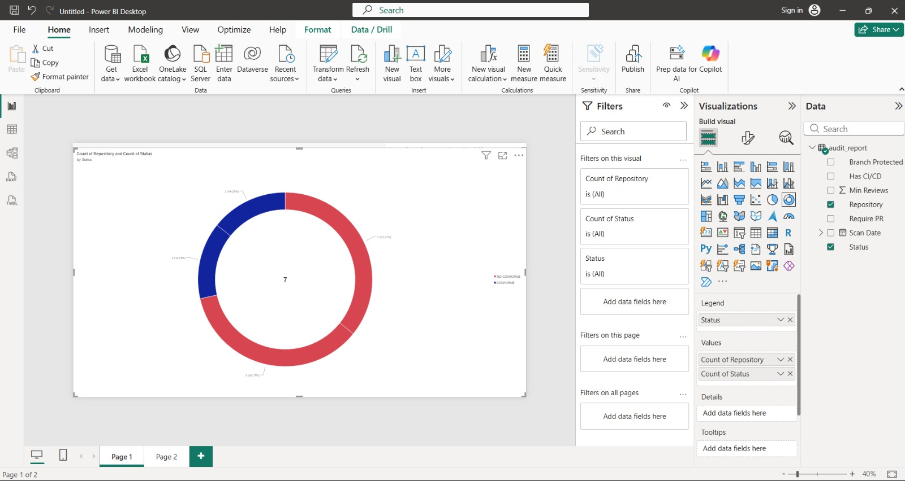
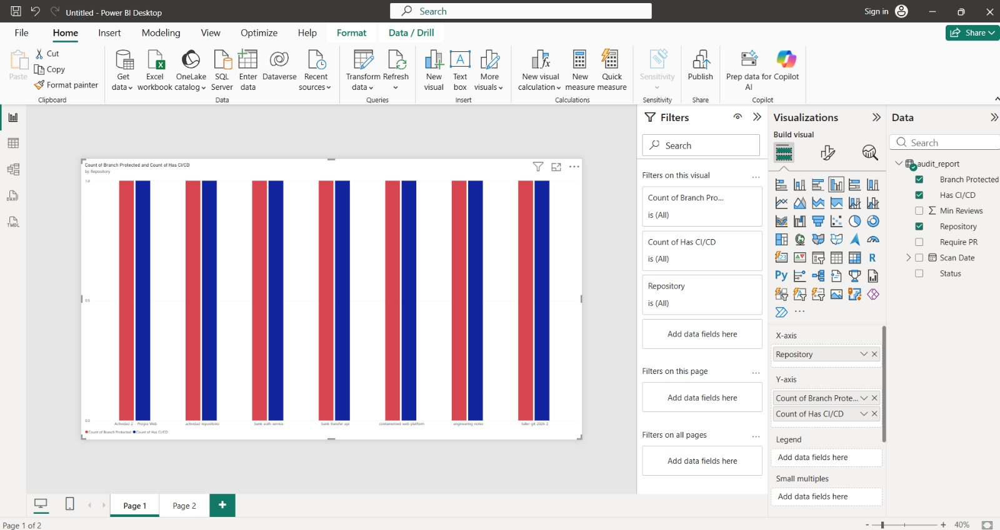
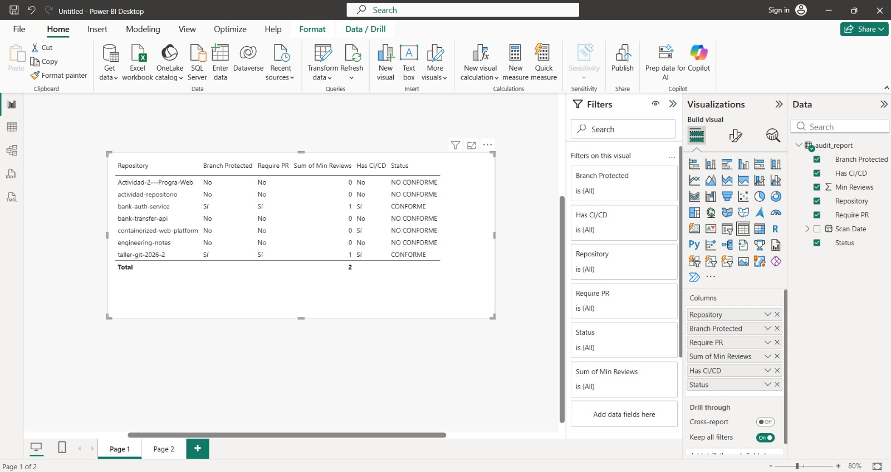

## RepoShield & Governance Auditor 

Solución automatizada de auditoría y gobernanza continua para ecosistemas de repositorios en GitHub. Diseñada para monitorear el cumplimiento de políticas de entrega continua, protección de ramas y estándares de calidad de código en arquitecturas distribuidas y microservicios bancarios.


## Problema de Negocio

En organizaciones con múltiples células de desarrollo (squads), la falta de controles automatizados genera riesgos operativos:
* Commits directos a ramas productivas sin revisión por pares.
* Ausencia de pipelines estandarizados de CI/CD para pruebas automáticas.
* Falta de visibilidad centralizada sobre la madurez técnica y gobernanza del código fuente.


## Arquitectura de la Solución

1. Motor de Auditoría (Python + PyGithub): Inspección automatizada mediante la API de GitHub para validar branch protection rules, requerimiento de PRs, aprobaciones mínimas y workflows activos en `.github/workflows`.
2. Capa de Persistencia (SQLite + CSV): Almacenamiento histórico de escaneos para trazabilidad y auditoría forense.
3. Tablero de Control Operativo (Power BI): Visualización de métricas de cumplimiento, distribución de riesgos y estado de gobierno por microservicio.


## Dashboard de Gobernanza (Power BI)

## Índice General de Cumplimiento
Resumen ejecutivo de repositorios conformes frente a aquellos con brechas de seguridad o políticas ausentes.


## Control de Protección de Ramas y CI/CD
Monitoreo de políticas críticas de entrega continua y bloqueos contra commits directos a ramas principales.


## Inventario Técnico y Matriz de Auditoría
Detalle granular por microservicio indicando reglas activas, revisiones mínimas requeridas y estado final de conformidad.



## Instalación y Ejecución

## Prerrequisitos
* Python 3.10+
* Personal Access Token de GitHub con permisos de lectura (`repo`)

## Configuración
```bash
git clone [https://github.com/dylan-salazar/repo-governance-shield.git](https://github.com/dylan-salazar/repo-governance-shield.git)
cd repo-governance-shield
python -m venv venv
.\venv\Scripts\Activate.ps1   # En Windows / PowerShell
pip install -r requirements.txt